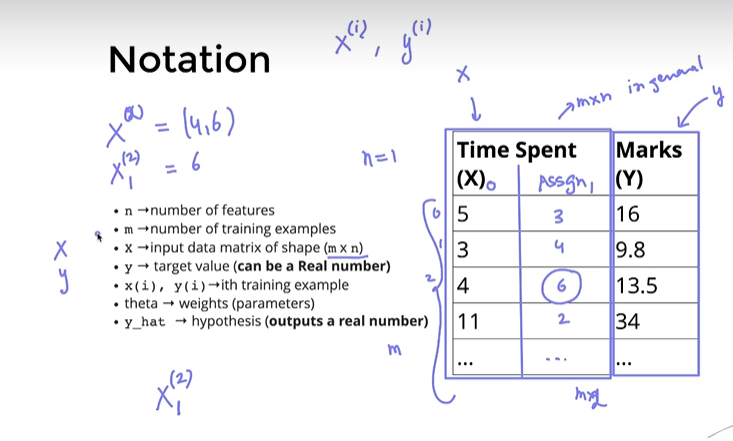
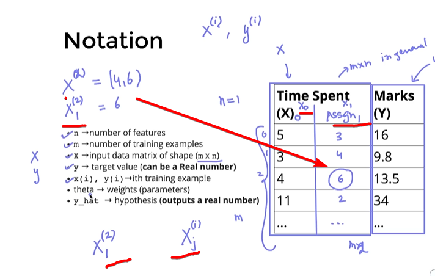
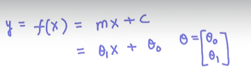

# Linear Regression (also known as Ordinary least squares)

Regression predicts a continuous value. now we will build an algorithm that solves the tas of predicting marks givena  labelled datasets.

the goal of the algorithm is to learn a linear model that predicts a y for an unseen x with minimun error. 

---

here the matrix size is mx1 where m= no. of training examples (rows) and n = features (columns)

if we introudce one more feature assignments then 
the matrix size would be mx2

and y is - vector [ output ] 

for here 

x ^2  = (4,6)  coz value of x is no. of row that is 2nd row. 

if it is x^2 1 then it is 6 only

Theta - weigths of the model

> x,y > model f(n) = 2x+2  ; here 2x+2 is parameters or weight of the model;  we denote that with theta.

f(x) = mx + c;

y = mx+ c;  - equation of straight line;  but in ML we use the term  = 

