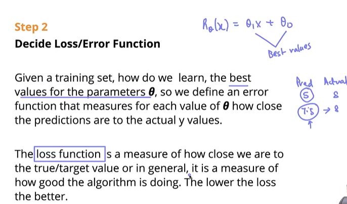
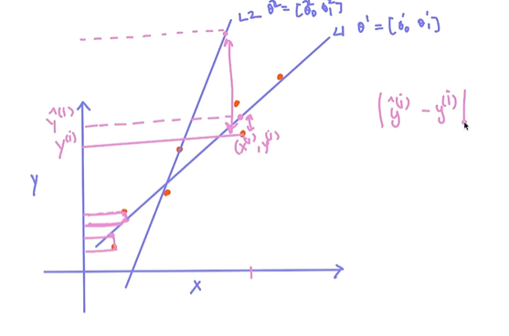
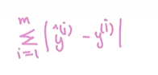
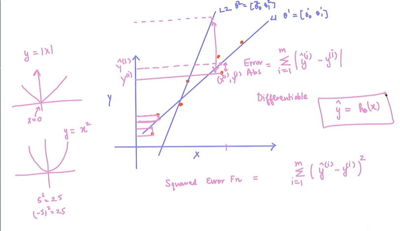
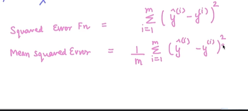
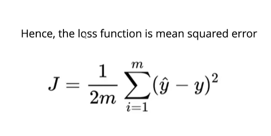
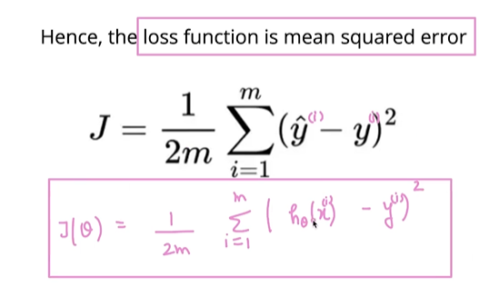

# Step 2 - Decide Loss/Error Function

*the loser is the loss, the better it is*

---

---

---

for total squared function:

---

mean squared error:

loss function/ error function in linear regression:

*better 0 theta means lower loss > and model is etter at predictions*