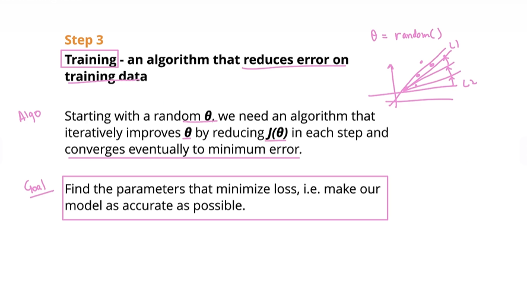

# Training -an algorithm that reduces error on training data

**Algo**
Starting with a randon 0 (theta), we need an algorithm that iteratively improves 0 theta by reducing j(0) in each step and converges eventually to minimum error.

**Goal:**

Find parameters that  minimize loss, i.e. make our model as accurate as possible.

