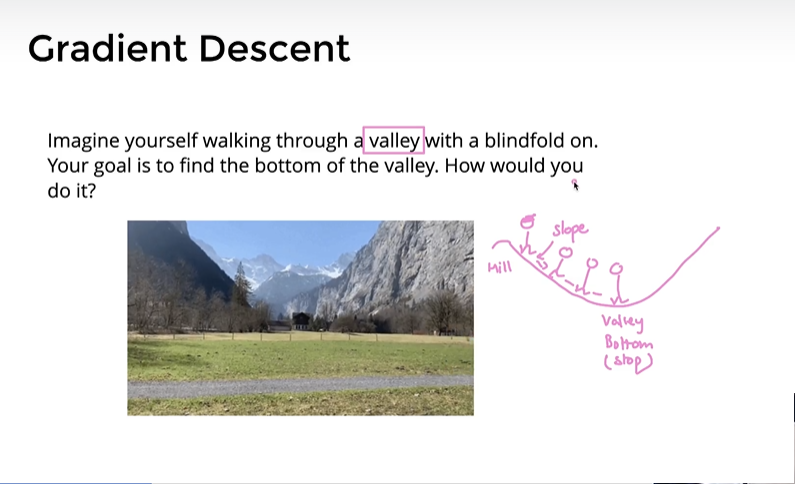
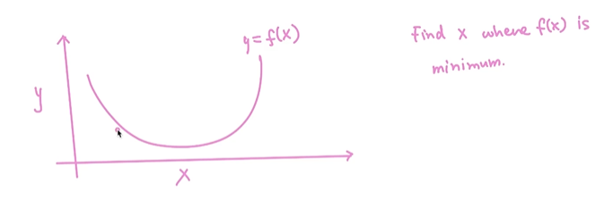
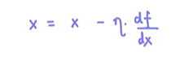
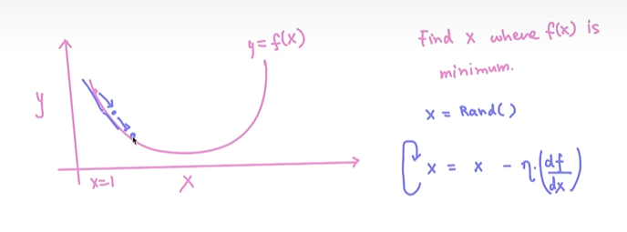
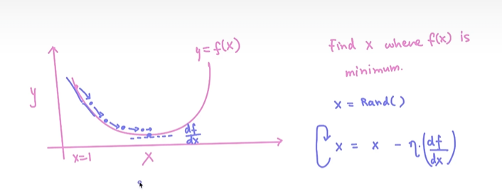
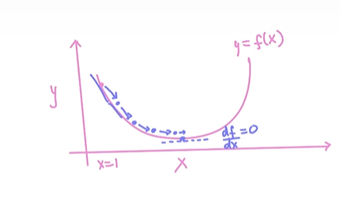
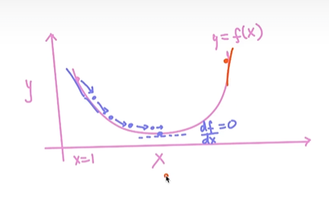
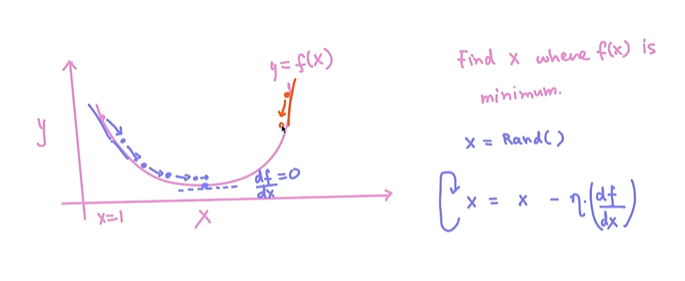
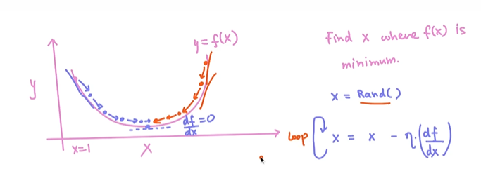

# 🩺 Gradient Linear Algorithm 📉

**Optimization**

-----

*💓 heart and soul of  supervised learning algorithms such as - linear regression, logistic regression, neural networks, deep neural networks*

The fundamental idea remains of optimization remains gradient descent.

So it's very important to understand this technique thoroughly.

### 📈Gradient descent:

Imagine yourself walking through a valley, right?

So suppose there is a mountain, right?

It is a mountain range.

And you are somewhere here.

So this is the hill part.

And this is the valley part, right?

Look the bottom of the value, right?

Your goal is to find the bottom of the value, right?

So maybe you are here and you want to find out.

The valley bottom, right?

So there is a blind hold on.

That means your eyes are covered.

You cannot see where you are walking.

Right?

How you would do it.

A very simple way of doing it would be that you will feel the slope of the hill using your feet.

Right.

You'll analyze.

How is the slope?

According to the slope, you will decide.

Okay, I should move in this direction.

Right.

Okay.

Again, you will analyze the slope at each step and you'll talk.

I should walk this way.

Again, analyze the slope.

You will say, okay, I'll walk this way.

And eventually you will reach at the point where the slope becomes zero and the valley bottom is reached.

And once you reach this, you can talk.

I'm going to stop.

This is what you will do.

So what you are doing, your analyzing the store slope.

According to the slope, you are taking small, small steps in that direction.

This is what exactly we do in gradient descent.

-----

**Mathematically -**

So our goal is to find out at what value of X do we get the minimum value of by.

Again, one way of doing it would be that we can use differentiation.

We can do direct differentiation, which we will see, of course, later on.

Right.

But the way we do it using gradient centres, we start with some random value of X, maybe I start from

here, it's OC, I start with x is equal to one.

So maybe X is here right now.

At this point I will analyze the slope, right?

So what do you think?

What is the slope here?

Right.

So slope is actually negative, right?

This slope is actually negative.

So what I really do, I should move one step here.

So how do we do it?

So this is done using an update equation.

So you say, okay, I'm going to start with some random value of X.

It could be one, it could be five, it could be 100, it could be anywhere.

And then what we will do, we will apply an update.

We will say, okay, x equals to x minus some constant.

I will tell you what is this concept?

It's called as learning rate.

Into.

How do we get the slope right?

The slope is nothing.

But you differentiate this function, right?

You can talk.

I'll do.

Different DfE upon the rate that means I'm finding out the slope that is negative, right?

So if slope is negative, this term at this point is negative.

So eventually what's going to happen?

Your X is going to increase.
You might end up here.
So you keep doing keep on doing it for many steps.
So you again, apply this update.
At this point, also, the slope is negative and you move in this direction.

Again, at this point, what's going to happen?
Slope is negative.

You're going to move in this direction.
You're going to move here.

Slope is negative.
You're going to move here.

At this point, if you calculate differentiation of this function, right?
So as oc d of F upon D of X rate.
So this is zero or close to zero, right?

Once you reach this point, what's going to happen?
X will not move forward.

So eventually I can say that I will stop here.

So you might ask, okay, what if if I do an initialization which is not from this point, but from
this point, this is the initial value of X.

And again, if you calculate the slope, the slope is positive, right?

It is large and it is positive.

If you apply this update x equal to x minus learning rate into some positive value, what's going to
happen?

So your x will reduce.

You will come here again.
Slope is positive.

So it does not matter from where you start, you will eventually converge at this minimum.

So this thing we will put inside the loop..Right?

So this is the general idea of gradient descent, Right.
To make this idea more clear.

